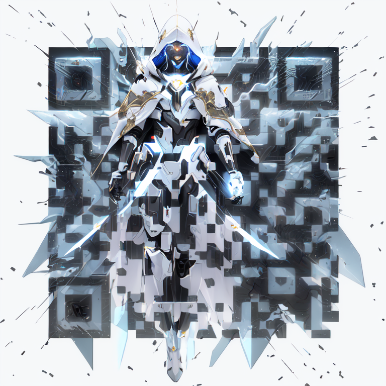

Howdy!

I am Ziyun Li(李子雲), and I also go by Stephen. I am an electrical engineer turned software engineer.

I am currently a ~~Senior~~ **Staff Software Engineer**, working on  ~~Xbox One at [Microsoft](https://www.microsoft.com/)~~ ~~enterprise learning management system at [D2L](https://www.d2l.com/)~~ ~~classroom engagement software at [Top Hat](https://tophat.com/)~~ [API platform](https://docs.instacart.com/connect) at [Instacart](https://www.instacart.com/).

---

You can also find me on [GitHub](https://github.com/ziyunli), [Twitter](https://twitter.com/ziyun_li), [Mastodon](https://fedi.ziyun.rocks/@ziyun), [LinkedIn](https://www.linkedin.com/in/ziyun-li-b1488425/), and [goodreads](https://www.goodreads.com/user/show/38527571-ziyun).

*I love hearing about cool technology, interesting projects, and new business ideas. If you have any of these, shot me an email with "hi" at this domain and let's talk!*

---

---

